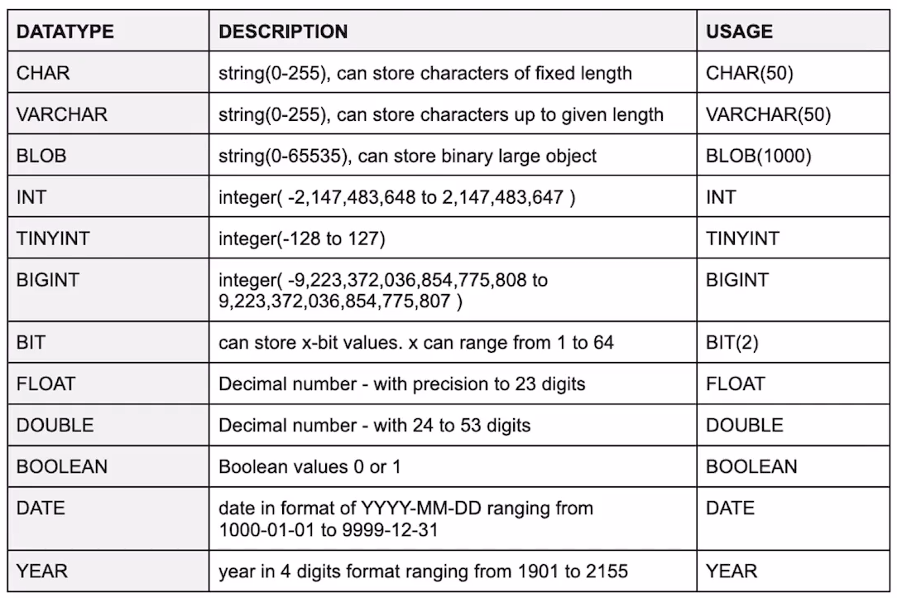

<h1 align="center">Structured Query Language</h1>
<br/>


## Database Queries

Creating a database ⬇️

```sql
CREATE DATABASE db_name;
```
```sql
CREATE DATABASE IF NOT EXISTS db_name;
```

Deleting a database ⬇️

```sql
DROP DATABASE db_name;
```
```sql
DROP DATABASE IF EXISTS db_name;
```

Show database ⬇️

> Befor using `SHOW TABLES` first `USE` the database

```sql
SHOW DATABASES;
```
```sql
SHOW TABLES;
```

## Data Types



## Table Queries

* Create
* Insert
* Update
* Alter
* Truncate
* Delete
  
## Constraints

Rules for data in the table

* NOT NULL ➡️ columns cannot have a null value
* UNIQUE ➡️ all values in column are different
* DEFAULT ➡️ sets the default value of a column
  * ```sql
    salary INT DEFAULT 25000,
    ```
* CHECK ➡️ it can limit the values allowed in a column
  * ```sql
    CONSTRAINT age_check CHECK (age >= 18 AND city="Delhi"),
    ```
* PRIMARY KEY ➡️ makes a column unique & not null but used only for one
  * ```sql
    CREATE TABLE temp (
      id INT NOT NULL,
      PRIMARY KEY(id)
    );
    ```
* FOREIGN KEY ➡️ prevent actions that would destroy links between tables
  * ```sql
    CREATE TABLE temp (
      cust_id INT,
      FOREIGN KEY (cust_id) REFERENCES customer(id)
    );
    ```
### More about PRIMARY KEY & FOREIGN KEY

#### What are Keys ?

Ans: Keys are special columns in the table

#### Primary Key

It is a column (or set of columns) in a table that uniquely identifies each row. (a unique id) There is only 1 PK & it should be NOT null.

#### Foreign Key

A foreign key is a column (or set of columns) in a table that refers to the primary key in annother table

FKs can have duplicate & null values.

There can be multiple FKs.

## Insert into Table

Insert into Table

```sql
INSERT INTO user
(id, age, name, email, followers, following)
VALUES
(1, 20, "Azim", "azim@azim.com", 1000, 10);
```
## Select Command

Selects & Show data from the DB

```sql
SELECT id, name, email FROM user;
SELECT * FROM user;
SELECT DISTINCT age FROM user;
```

> `DISTINCT` is uswed so show all unique values.


<br/>


TABLE EXAMPLE:

```sql
CREATE DATABASE IF NOT EXISTS instagram;
USE instagram;

CREATE TABLE user (
	id INT PRIMARY KEY,
    age INT,
    name VARCHAR(30) NOT NULL,
    email VARCHAR(50) UNIQUE ,
    followers INT DEFAULT 0,
    following INT,
    CONSTRAINT CHECK (age >= 18)
);

INSERT INTO user
(id, age, name, email, followers, following)
VALUES
(1, 20, "Azim", "azim@azim.com", 1000, 10);

CREATE TABLE post (
	id INT PRIMARY KEY,
    content VARCHAR(100),
    user_id INT,
    FOREIGN KEY (user_id) REFERENCES user(id)
);

INSERT INTO post
(id, content, user_id)
VALUES
(2, "Hello, World", 1);

SELECT id, content, user_id FROM post;
SELECT * FROM user;
SELECT DISTINCT age FROM user;
```

<br/>

> To visualize tables use `Ctr + R` ⬇️


## Where Clause & Limit Clause

To define some conditions

```sql
SELECT name, followers
FROM user
WHERE (followers >= 500)
LIMIT 10;
```

> All kind of Operators can be used in `WHERE` Keyword<br/>including: Arithmetic, Comparison, Logical & Bitwise

> `LIMIT` limits the output


## Order by Clause

To sort in ascending `ASC` or descending order `DESC`

```sql
SELECT name, followers
FROM user
ORDER BY followers DESC;
```

> Deafult order is `ASC`

## Aggregate Functions

Aggregate functions perform a calculation on a set of values, and return a single value.

* COUNT( )
* MAX( )
* MIN( )
* SUM( )
* AVG( )

EXAMPLE:

```sql
SELECT  max(followers)
FROM user;
```

## Group by Clause

